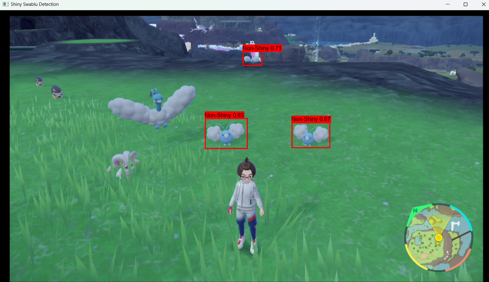
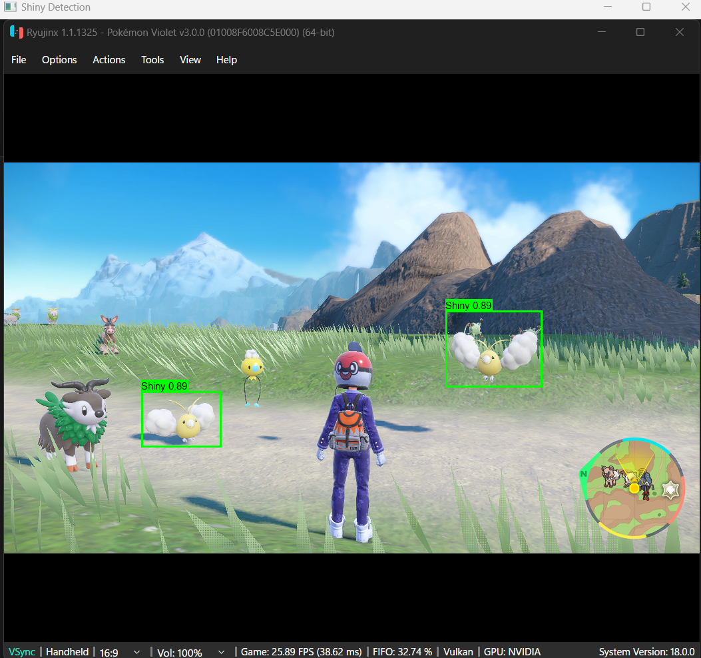
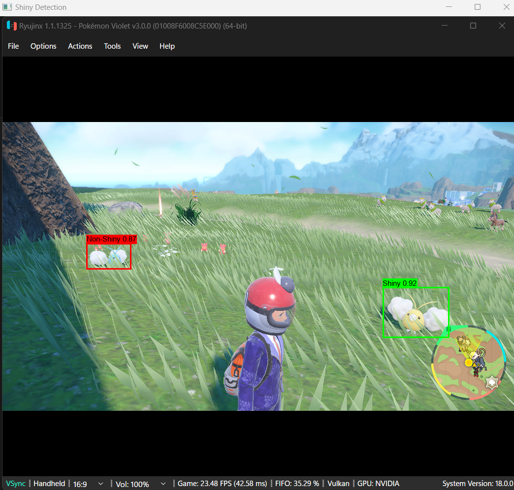

# Shiny Pokémon Detector with Machine Learning

I have always loved Pokemon, especially shiny pokemon. The colors, the rarity, the bragging rights, all of it - it's all part of the excitement! In the Pokémon games, the odds of encountering a shiny Pokémon are 1 in 8,192 in older games and 1 in 4,096 in newer ones. While there are methods to increase these odds (see [Bulbapedia's article on Shiny Pokémon](https://bulbapedia.bulbagarden.net/wiki/Shiny_Pok%C3%A9mon)), it's still easy to miss a shiny when exploring the vast overworld of games like **Pokémon Scarlet and Violet**.

But what if you had a second pair of eyes to help you spot that shiny Pokémon as soon as it appears on screen? Introducing **Shiny Pokémon Detector**, a machine learning project that automatically detects shiny Pokémon in real-time as you play!

*Note: Currently, this project supports **Swablu**. More Pokémon may be added in the future.*

## Table of Contents

- [Features](#features)
- [Prerequisites](#prerequisites)
- [Installation](#installation)
- [Usage](#usage)
  - [Using a Capture Card and OBS Studio](#using-a-capture-card-and-obs-studio)
  - [Alternative: Using an Emulator (For Legally Obtained Games)](#alternative-using-an-emulator-for-legally-obtained-games)
- [Training](#training)
- [Limitations](#limitations)
- [Contributing](#contributing)
- [License](#license)
- [Acknowledgments](#acknowledgments)
- [Screenshots](#screenshots)
- [Feedback](#feedback)

## Features

- **Real-time Detection**: Automatically detects and classifies Swablu as Shiny or Non-Shiny while you play.
- **User-Friendly Interface**: Visual overlays with bounding boxes and labels directly on your game screen.
- **Extensible Architecture**: Designed to support more Pokémon with additional training data.
- **Open Source**: Community-driven project welcoming contributions.

## Prerequisites

- **Operating System**: Windows 10 or 11
- **Python**: Version 3.12
- **Anaconda**: For managing the Python environment
- **Dedicated GPU**: NVIDIA GPU with CUDA support (tested with RTX 2080 Ti)
- **CUDA Toolkit**: Version 12.4 ([Download here](https://developer.nvidia.com/cuda-12-4-0-download-archive))
- **Pokémon Scarlet or Pokémon Violet** for Nintendo Switch
- **Capture Card**: To capture gameplay from your Nintendo Switch (I used [this one](https://www.amazon.com/Mirabox-Passthrough-Nintendo-Streaming-Recording/dp/B08QJ84JNP?th=1))
- **OBS Studio**: For setting up the virtual camera feed from your capture card

## Installation

1. **Clone the Repository**

   Open your terminal or command prompt and run:

   ```bash
   git clone https://github.com/vyabor/shiny-pokemon-ML.git
   cd shiny-pokemon-ML
   ```

2. **Set Up the Conda Environment**

    Create and activate the shiny_pokemon_ml environment:

    ```bash
    conda create --name shiny_pokemon_ml --file "requirements.txt" python=3.12 -c conda-forge -c pytorch -c nvidia
    conda activate shiny_pokemon_ml
    ```

## Usage

### Using a Capture Card and OBS Studio

1. **Set Up Your Capture Card and OBS Studio**

   - **Connect Your Nintendo Switch**: Use the capture card to connect your Nintendo Switch to your PC.
   - **Open OBS Studio**:
     - Add a new **Video Capture Device** source and select your capture card.
   - **Start Virtual Camera**:
     - Click **Start Virtual Camera** in OBS to make the video feed available to other applications.
   - **Verify Video Feed**:
     - Ensure that OBS Studio is displaying the game feed correctly.

2. **Run the Detector**

   - **Open the Notebook**:
     - Open `detector.ipynb` in your preferred IDE (e.g., Jupyter Notebook, Visual Studio Code).
   - **Select the Correct Python Environment**:
     - Ensure that your Python environment is set to `shiny_pokemon_ml`.
   - **Adjust Video Capture Index**:
     - Locate the code cell that initializes the video capture:
       ```python
       cap = cv2.VideoCapture(3)  # The integer might be different on your system
       ```
     - If the video feed doesn't appear when you run the cell, try changing the integer in `cv2.VideoCapture()` to another number (e.g., 0, 1, 2). This number corresponds to the index of video devices on your system.
   - **Run the Notebook**:
     - Execute the cell in the notebook corresponding to the capture card method.

3. **Start Shiny Detection**

   - A window should pop up displaying the game feed with bounding boxes around detected Swablu.
   - **Shiny Swablu** will be highlighted with a **green** bounding box.
   - **Non-Shiny Swablu** will be highlighted with a **red** bounding box.
   - **Exit the Detection Window**:
     - Press the **Q** key on your keyboard when you're ready to exit.

### Alternative: Using an Emulator (For a Legally Obtained Copy of Pokemon Scarlet or Violet)

*Note: Ensure that you comply with all legal requirements and terms of service when using emulators and ROMs.*

1. **Set Up Your Emulator**

   - Use a legal emulator compatible with your operating system.
   - Ensure you have a legally obtained copy of Pokémon Scarlet or Violet.

2. **Adjust the Detector Code**

   - **Modify the Window Title**:
     - In the `detector.ipynb` notebook, adjust the `window_title` variable to match your emulator's window title:
       ```python
       window_title = "Your Emulator Window Title"
       ```
   - **Run the Notebook**:
     - Exectute the cell in the notebook corresponding to the emulator method.

3. **Start Shiny Detection**

   - A window should pop up displaying the game feed with bounding boxes around detected Swablu.
   - **Shiny Swablu** will be highlighted with a **green** bounding box.
   - **Non-Shiny Swablu** will be highlighted with a **red** bounding box.
   - **Exit the Detection Window**:
     - Press the **Q** key on your keyboard when you're ready to exit.

## Training

Interested in expanding the project or improving detection accuracy? You can train the model on additional data or add support for more Pokémon.

### Prepare Your Dataset

- **Collect Images**:
  - Gather images of the Pokémon you wish to detect, including both shiny and non-shiny variants.
- **Label the Images**:
  - Use a tool like [LabelImg](https://github.com/tzutalin/labelImg) to annotate your images in the YOLO format.

### Modify the Training Notebook

1. **Open `train.ipynb` in your IDE.**
2. **Update Dataset Paths**:
   - Adjust the paths to point to your new dataset.
3. **Adjust Training Parameters**:
   - Modify parameters like batch size, epochs, and learning rate as needed.

### Train the Model

1. **Run the cell in `train.ipynb` to start training.**
2. **Monitor Training**:
   - Keep an eye on the training progress and adjust parameters if necessary.
3. **Save the Model**:
   - Once training is complete, the model weights will be saved to best.pt and can be used in the detector.

## Limitations

- **Current Support**: Only supports Swablu at the moment.
- **Detection Accuracy**: May produce false positives or negatives due to limited training data.
- **System Requirements**: Requires a powerful GPU for real-time detection.
- **Environmental Variables**: Detection accuracy can be affected by in-game lighting and weather conditions.

## Contributing

Contributions are welcome! Here's how you can help:

- **Add Support for More Pokémon**: Expand the dataset and retrain the model.
- **Improve Accuracy**: Finetune the model or enhance the training dataset.
- **Optimize Performance**: Suggest code improvements or model optimizations.
- **Report Issues**: If you encounter bugs or have suggestions, please open an issue.

**To contribute**, fork the repository, make your changes, and submit a pull request.

## License

This project is licensed under the [MIT License](LICENSE).

## Acknowledgments

- **[Ultralytics YOLOv8](https://github.com/ultralytics/ultralytics)**: For the state-of-the-art object detection framework.
- **Pokémon Franchise**: For the inspiration and assets.
- **Community**: Thanks to all contributors and users who help make this project better!

## Screenshots

Here are some examples of the Shiny Pokémon Detector in action:

### Capture Card Setup


### Emulator Setup - Example 1


### Emulator Setup - Example 2


---

**Disclaimer**: This project is intended for educational and personal use. Please ensure you comply with all relevant laws and policies when using this software.

---

## Feedback

If you have any questions or need assistance, feel free to reach out or open an issue in the repository.
